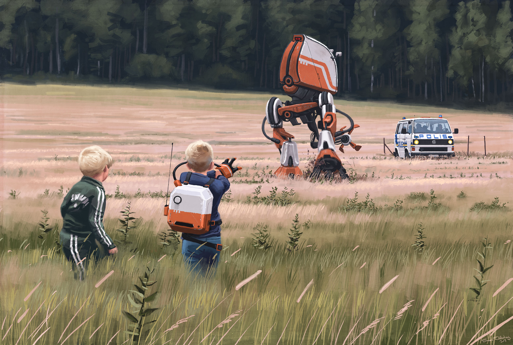
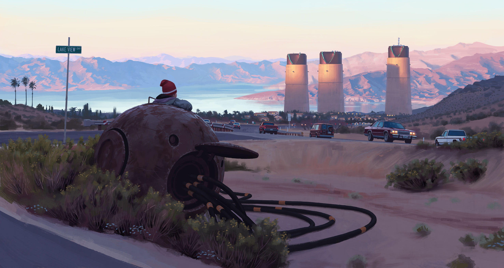
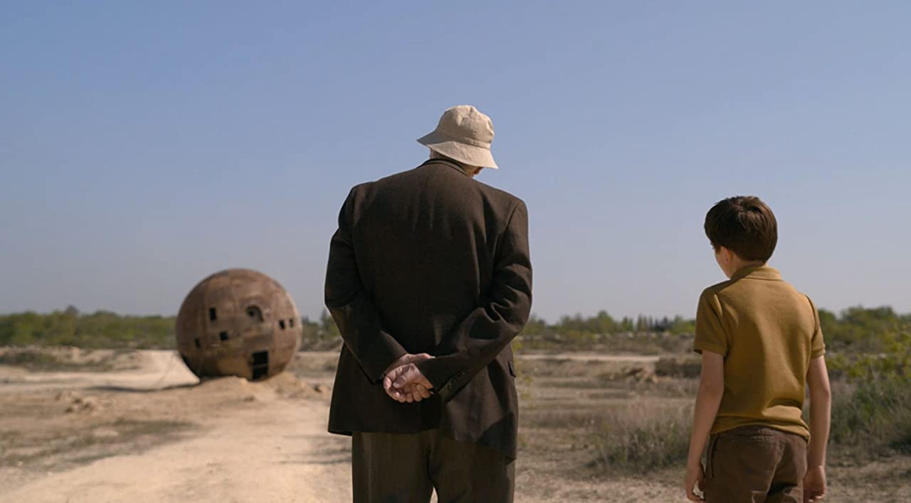
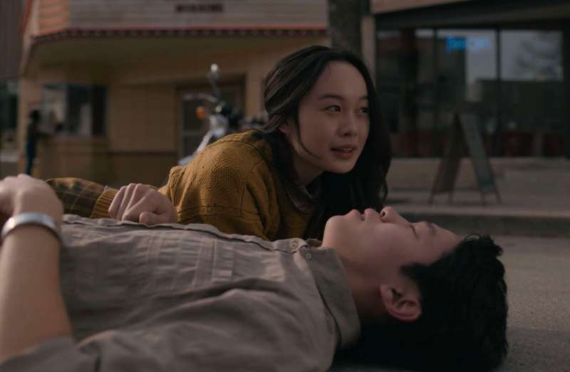

# The Beauty and Brilliance of Tales From the Loop

I recently just finished watching the first season of Tales From the Loop after having also bought the original artbook mid-way through the season because of how "entranced" I was by the concept and art. Tales From the Loop was originally an artbook by [Simon Stålenhag](https://twitter.com/simonstalenhag?s=20) and it's truly mesmerizing. In this post, I talk about his art, and then the story and show that grew from the art.

A brief bit of context, "The Loop" was a fictional underground research facility comprised of a particle accelerator for experimental physics, and it produced a number of "artifacts" that are left unexplained, but there for the world to interact and experience with.

<h2 id='The-Art'>The Art</h2>

Original book's cover art

His art forms a beautiful intersection of the ordinary with the extraordinary. Best of all, none of the extraordinary is explained.

Sounds crazy, but really, it's beautiful. 

And if you don't like the way I put it, see [the art](https://www.simonstalenhag.se/tftl.html) for yourself, or this [post](https://blogs.scientificamerican.com/symbiartic/childhood-of-tomorrow-the-art-of-simon-st-229-lenhag/) from Scientific American, or this [post](https://www.theverge.com/2013/8/27/4664842/sweden-reimagined-what-if-sci-fi-tech-were-real) from The Verge.

Despite being a typical knowledge-hungry student, I'm actually happy that Tales From the Loop leaves every mystery unexplained and learned a few things from that.

When I was younger my mom forced me to go to a ton of art museums because she likes art (and is an amazing artist herself) and I guess she believes exposure to art is an important part of my upbringing. I disliked most of the trips, hated the lack of benches, and most of the time asked the same question: "why is the art so expensive?"

It takes time to understand art at a deeper level, but time has passed and now one thing I did take out of all of those art museums is that a lot of meaning and beauty of art stems from how you interpret it, how you want the story to be told. I'm no art expert myself but I think the beauty of it is that you can have your own "meta" interpretation of art in general, and the art will have succeeded in curating thought and inspiration possibly.

Strange towers and spheres, and an unaffected suburban vibe

My own interpretation of Stålenhag's art stems from the similar vision the writers and producers and composers of the series had, and that the true story doesn't lie within the fantastical elements, but how the fantastical elements interact with the ordinary  and cultivate human relationships, feelings, and story. 

The show captures this vision completely. With the help of a strong, artistic basis, writer / producer Nathaniel Halpern and composers Phillip Glass and Paul-Leonard Morgan were able to turn static photos into a breathtaking series of episodes.

<h2 id='The-Show'>The Show</h2>

Every single episode has some artifact that underpins the story of that episode. We're never told how that artifact works, we only see how the events unfold. 

Russ Willard and his Grandson Cole visit the Echo Sphere. Context: Russ is the director at The Loop and his whole family basically works there

In the picture above, the Echo Sphere was a device leftover from old experiments that estimated how much time you have left in your life through the number of echos. When Russ didn't get a single echo back and told Cole the sphere wasn't broken, my heart sank. I've already forgotten about the intriguing behavior of the echo sphere, and already directed my attention to the grandfather grandson relationship Russ and Cole had. 

Now imagine watching several of these moments each episode unfold over the course of a season. 

Despite Cole and his family being a bit of the "center-piece" of this show, the show also follows the stories, the loops, of other individuals as well. In the third episode, May initially wishes for special moments to last forever, of which she "solves" by building a time stopping machine that stops time for everyone without a special bracelet.

May and Ethan talk while for everyone else time is stopped

Yet despite stopping time for a long time, the relationship between May and Ethan turns sour and it ultimately ends with Ethan dropping his bracelet, freezing Ethan in time. May is forced to unstop time and learns that moments are special because they do not last. May echos another common theme throughout the show: there are no second chances, you have to come to terms with whatever happens, and this speaks to the amazing realism of the show. 

Like May, Cole has to come to terms with the due course of nature, and unfortunately for Cole, he faces this many, many times, from his grandfather's passing to his brother's conscience being swapped into a robot that breaks down in the final episode.

This also speaks to the generalizability of the core concepts behind Tales From the Loop. Tales From the Loop provides a structure that allows the creators to use different perspectives and stories to convey the same motifs. There are a myriad of other sublteties that elevate the art and show to astounding levels of meaning and depth, and I haven't even gotten to the music powering the evocative periods of silence in the epiodes. For the sake of brevity, I stop here, and recommend you watch the show yourself because my words alone are not enough to capture the beauty of Tales From the Loop completely.

Through Stålenhag's art and the unbelivable show, I learn that I have to come to terms with what's given, my actions, and other's actions, and the force of nature. Sometimes the mysteries aren't meant to be explained, we are there to just witness the phenomena.

I really hope there is a second season, but it's probably the end of the loop for this story. Perhaps another timeline can create a similar undefinable feeling that Tales From the Loop gives.

It was brilliant.

Anyway, blog post no.2 done,

🌊
