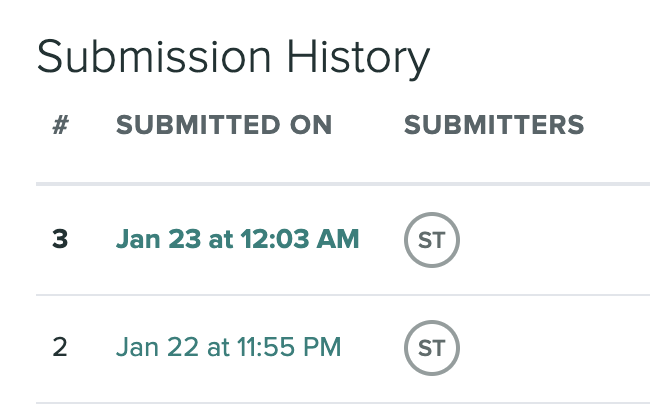
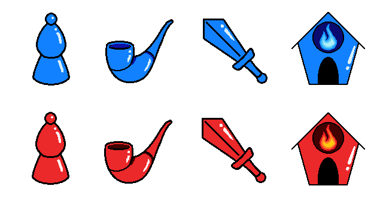
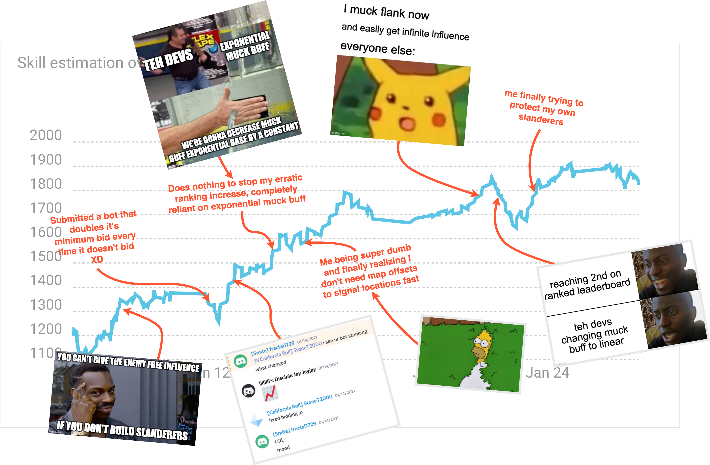
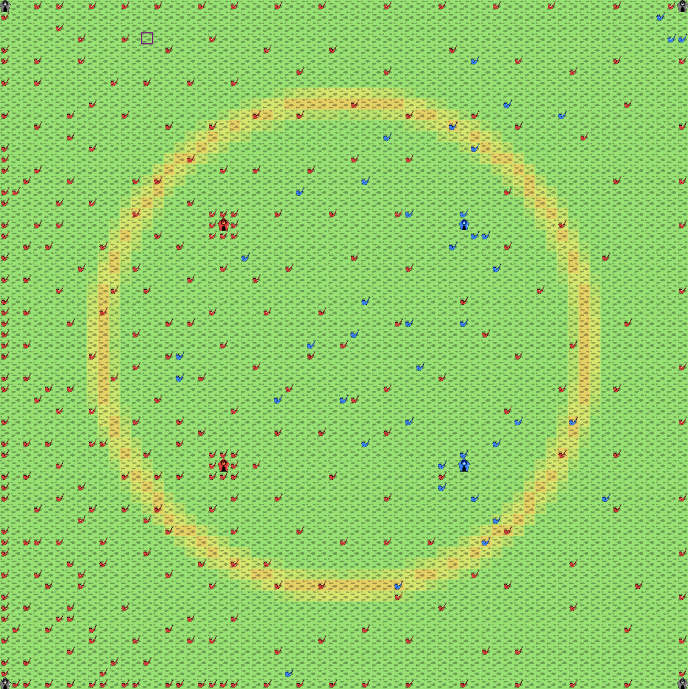
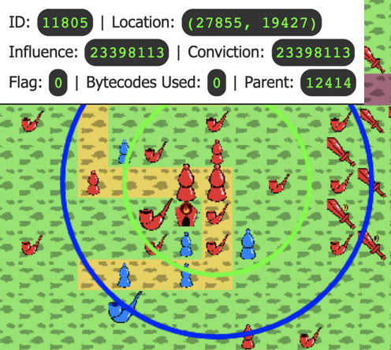
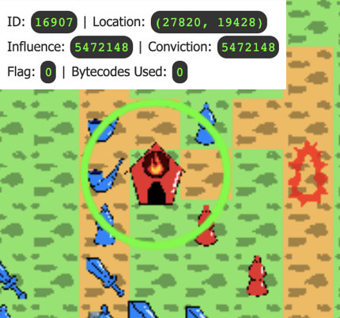
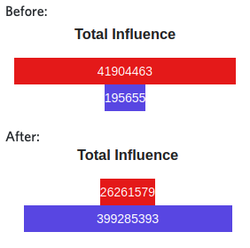
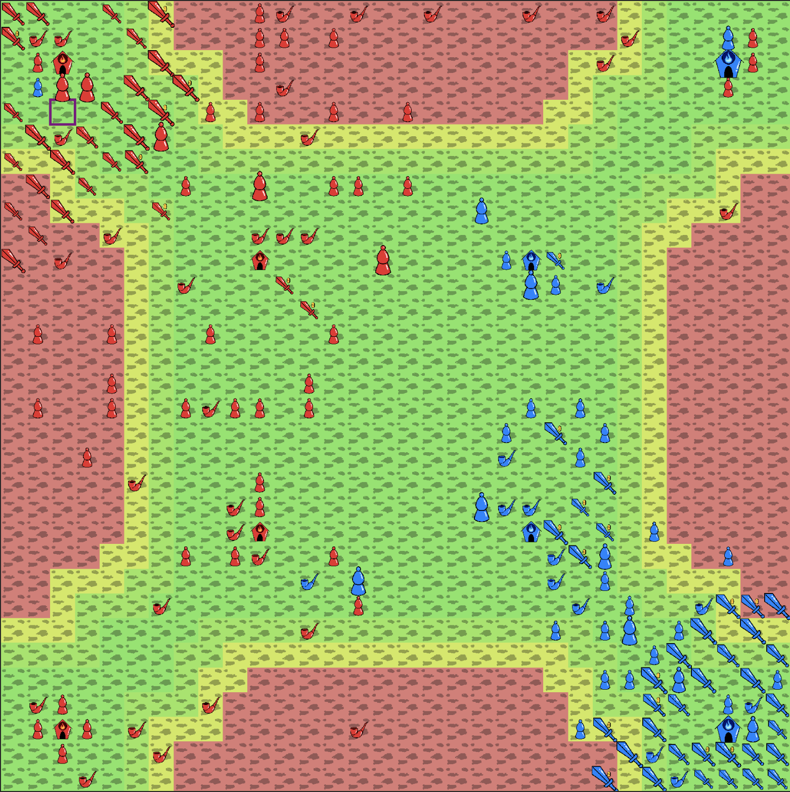
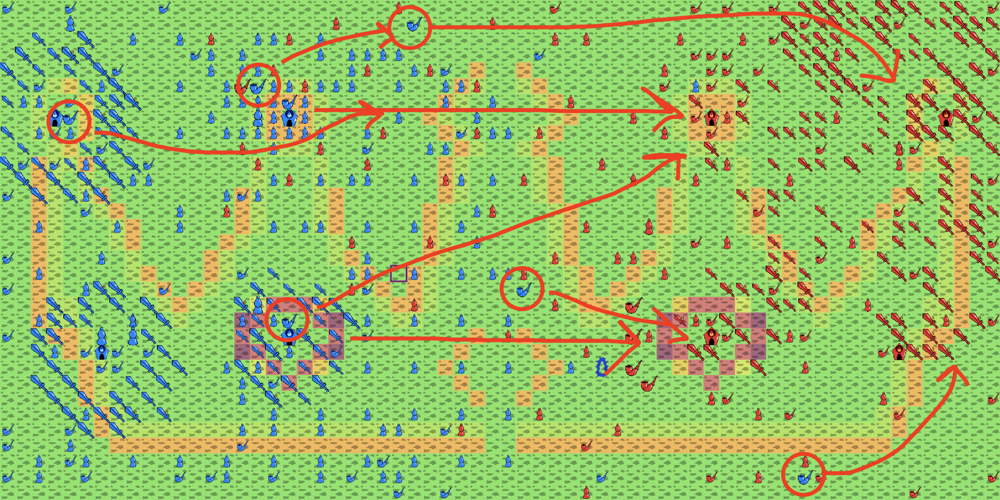
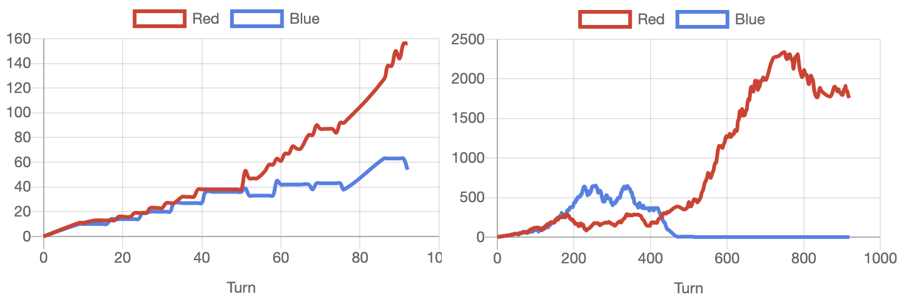

# Battlecode 2021 Postmortem

This is my 4th year competing in MIT Battlecode. I previously competed as Bowl of Chowder (5th) in 2020, and as Codelympians (9th) in 2019 and was Codelympians in 2018 but did not make finals the first year.

This year I once again soloed my way to finals, achieving 9th overall, and to my surprise, won the "Adaptive Strategy" award for spearheading the development of a strategy known as "muck flanking."My team name was California Roll (however it's listed as Chop Suey online)

Apparently a significant number of people read [my postmortem from last year](). Traffic to that post jumped by ~1000% for a few days and was quite high over the course of the competition. As a result, this incentivized me to write a better postmortem that isn't all about a single competition that most people won't understand without having competed in it. Instead, I decided to have a [gentler introduction](#A-Gentle-Introduction-a) that isn't a wall of text, and focus more on general points not specific to Battlecode 2021, but on Battlecode and AI programming competitions in general. I still include the traditional "timeline" format of Battlecode postmortems in a [later section](#The-Battlecode-2021-Timeline-a). I also now include my [evaluation](#My-Evaluation-a) of the year's design, it's features, what makes it good / interesting / fun, and what wasn't so great. If you want to read my unreadable code, it's here: https://github.com/StoneT2000/Battlecode2021/

<h2 id='A-Gentle-Introduction'>A Gentle Introduction</h2>

So what is **Battlecode**? It's this [thing](http://battlecode.org/). Longer answer: it's a student run organization at MIT dedicated to hosting an annual **AI programming competition** that pits your strategies and code against other competitors for a sizable prize pool. They welcome competitors of all ages, although the main tournament is for full-time students / students in transitionary periods only.

But what exactly is AI programming? No, it is not necessarily advanced, state of the art, reinforcement learning algorithms using [PPO](https://openai.com/blog/openai-baselines-ppo/). It can be, but in the context of Battlecode it's usually near impossible to use advanced AI algorithms due to a whole host of reasons. So now what? We rely on good old fashioned reliable: conditional branching. Every single bot submitted to Battlecode (that performs well) is effectively a giant, carefuly curated, grown, and pruned, decision tree (with some pathing and optimization algorithms here and there).

Your programmed agent received state information about the game it is playing from the engine, and then it sends back it's actions. Rinse and repeat. This keeps going on until one team objectively does better after a time limit, either by playing the game correctly and scoring high on some metric, or in the case of Battlecode, absolutely annhilating the other agent on the game field.

This kind of AI programming requires a different kind of thinking and analysis. The **creative** kind, as well as the **copying** kind (more on that later), perhaps well combined into **creative copying**. This different kind of thinking is what allows top competitors to create the best bots, in addition to some decent programming skills but you usually never go beyond a Dijkstra's difficulty algorithm.

If you want to get involved and compete, I highly recommend joining the Battlecode community and discord: https://discord.gg/zYzCjEvuuJ. Battlecode has been historically deeply rooted in traditions (like finalists playing the Terraforming Mars board game at the finals) and a strong community. I think even half of the dev team, including their current president Jerry, are Battlecode alumni, with Jerry having most recently competed back in 2019. Shout out to all the legends who have been around for years. It'll be sad to see that XSquare (who is on his 7th? year of Battlecode) is finally graduating from graduate school and no longer eligible to compete in the main tournament anymore. Regardless, it is a community you don't want to miss out on. It was thanks to Battlecode that I got into computer science, cogntive science and AI! I for sure will not make 2021 my last year of Battlecode.

<h2 id='What-Got-Me-to-Finals'>What Got Me to Finals</h2>

First I'll define a few common keywords / AI competition jargon that often gets thrown around

**Economy**: Usually in a competition, especially in Battlecode, there is some sort of resource that enables your bot to do something. A bot's economy is then based on how well they generate this resource.

**Specs / Design**: I like calling it the design but its more commonly referred to as the specs. This is the document / information that defines how the competition works, how one or more agents compete to get rankings / scores.

**Macro / Micro**: Macro refers to strategy that controls overall behavior of a bot. Micro refers to strategy that controls specific, local, behavior of a bot at the smallest scale (e.g. individual unit behavior).

**RNG**: This stands for random number generator, but it describes events that just occur by chance or objects that can randomly cause / change behavior by chance. This is also sometimes used like a verb to say something was impacted by random chance.

This year a few major factors helped me make it to the finals of Battlecode. 

1. Total disregard for homework and finishing them the day they are due (don't do this please)
2. Copying early-game build queues
3. "Spearheading" the development of a strategy known as "muck flanking" and being one of the first to use it
4. Being fairly active on discord (or at least reading strategies and ideas that were floating around).

The above points are quite general and usually apply to every year of Battlecode, with point 3 being specific to this year. 

Last year I may have bombed a midterm while doing Battlecode. This year I had to clutch two homework assignments and submitted one of them during the 5 minute submission grace period at 12:03 AM, solving the last problem at around 12:01 AM after submitting the rest at 11:55 PM the previous day. I highly do not recommend disregarding homework. To be frank, I was lucky that the homework assignments weren't too bad and were on topics I knew fairly well, but I might not be so lucky next year. This is typically a result of 1. UCSD starting on the same day Battlecode starts and 2. soloing each time.

The most clutch moment of my academic career

Regardless, my disregard gave me more time to tune my bot, add some nice features and the biggest constraint in Battlecode is usually time. Competitors are given about 3 weeks to code a bot ready for qualifiers to then qualify for finals, with then about 2 more days to further develop the bot for the finals tournament. Add on the usual spec changes that occur during the middle, time is really hard to come by. Many teams including mine end up having long todo lists that can't get finished because there is simply not enough time to code our ideal bot.

Something that also helped me a great deal and bounce back after the nerf to a crucial feature that was winning me games was copying some other top bot's build queues. Build queues are the order in which your controlled buildings build units to interact with the game and win. Apparently I had a pretty bad initial build queue that put me at a significant resource disadvantage a lot. After copying other team's queues, I instantly shot back up.

My highest ranking was a 2nd place on the ranked leaderboard after I started to abuse my muck flank strategy more explicitly instead of implicitly (unfortunately after nerf the strategy was less overpowered). It was originally something my bot did on accident, but after I saw the potential I made it more explicitly coded into the bot. But regardless of what exact strategy this was, the key point is that careful analysis of match replays is crucial to doing well. Without analyzing past matches against myself or other bots I wouldn't have been able to abuse this strategy more, or copy strategies from other players.

Lastly, being active on discord as usual helps quite a bit for me. It's funny with its memes and stuff but is also another medium to glean strategies, copy strategies, and discuss strategies with other competitors. There's always going to be people on discord sharing ideas that have proven quite useful. For example, I didn't notice you could actually encode a location on a 64x64 map in 14 bits when all the map coordinates are offset by values on the order of 10^4. It was only until I caught onto some discussion about it until I realized my mistake, and thus improving my bot efficiency 2 fold in comms.

<h2 id='Lessons-Learned'>Lessons Learned</h2>

Do not assume early, copy more, read specs carefully, flesh out features on specs before code.

Basically, a combination of the above 4 points led to a lot of time wasted on my bot this year, as well as some poorly written code and strategy. This is evidenced by how my final bot's files has a lot of unused code from old scouting code to unused communication signals.

In the first week, I decided that pathfinding was not going to be important since there were no real walls on the game map, just passability values representing how long it takes to get across that map tile. Thus instead, I decided this year I would focus more on good communication code and optimization and assumed that pathfinding wouldn't come back to bite me. This was most likely a mistake. The exact reasons are explained in the timeline section, but from a high-level, very greedy pathing was a lot worse than I anticipated than optimized pathing based on something like Dijkstra's algorithm. Making such a big decision early on setup my bot for a lot of issues. With less focus on pathing, I had pathing problems for a week and a half that I didn't notice, as well as issues with being very slow to gain map control as my units take much longer to get to the opponent, as well as poor attacks as my units also take forever to launch an offensive.

Surprisingly, I didn't end up copying opponent teams as much as I usually do. The time I did (copying build queue) I instantly did better, so somehow this reward signal did not resonate deeply this year. On the bright side, this is the first year I've heard of other teams copying *me* as opposed to the other way of around. Supposedly one team copied my build queue (which was adapted from team confused and team Malott Fat Cats) and multiple teams copied my slanderer latticing strategy (although I think latticing was quite an obvious strategy that most people figured out themselves)

Another issue was a poor / messy understanding of the specs this year. I'd like to argue from a design principle angle, this isn't much my fault, Battlecode should just work on having more concise and unambiguous specs. Regardless, I still felt that I misread quite a lot early onto the game, making me throw away some of my initial code. Not understanding this year's specs that well also caused some erroneous / poorly thought out code to be left in my bot.

Even towards finals, I was considering some new strategies that actually wouldn't work because of limitations I didn't read carefully about. I dived straight into the code and implmentation of some strategies without having fleshed out its feasibility on the specs first, assuming that my conceptual model of the specs were accurate. As a result, more code was written that got thrown away / left in the bot that doesn't get used.

<h2 id='The-Battlecode-2021-Timeline'>The Battlecode 2021 Timeline</h2>

This section covers a intro on the 2021 iteration of Battlecode specs and how Battlecode works, how the meta / strategy developed over time in relation to the tournaments and my own bot. It dives into some of the unique strategies used as well as looking into how teams reacted to various spec changes and more.

### Intro to Battlecode 2021

This year, Battlecode 2021 was based around 4 units, Politicians, Muckrakers, Slanderers, and Enlightment Centers. The objective was to either have the most votes by the end of the 1500 round limit or to eliminate all opposition units from the field.

Battlecode 2021's units. From left to right: Politicians, Muckrakers, Slanderers, Enlightment Centers

Each of these units had different properties and abilities that helped shaped the virtual political landscape as either party wrests for control of the map. All units have a certain circular vision radius, determining what local information is visibly available to the unit. Morerover, every unit can perform some acton each turn provided their cooldown is below 1. Different units increment cooldown more than others when performing actions.

Every single unit runs its own instance of your code, and cannot share variables with other units nor even see them unless in their vision radius.

In particular, mobile units have **influence** and **conviction**. Their conviction value is dependent on their initial influence, and can change over time depending on what happens. 

And as usual, the game is situated on a **2D square grid map** where units can move in 8 directions (North, Northeast, East etc.) and all units run in order of a **turn queue**. However, unlike previous years, there are no walls that can block movement. There is a concept of **passability** for each map tile, which determines how much more a units cooldown increments whenever they perform an action on that map cell. So low passability tiles on a map slows down mobile units because movement is an action and will increase cooldown a lot more than other higher passability tiles. Immobile units are also affected by passability. In future pictures, low passability is denoted by dark tiles, high passability is denoted by green tiles.

Now I will explain the units from a high level.

**Enlightment centers (EC)** are the only immobile units. They hold influence that can be spent to bid each turn for a vote or build mobile units with starting **influence** equal to the influence spent. The way voting works is that every single enlightment center on the map, your team or the opposition team's, must bid to gain the vote that turn. The winning bidder gains the vote, whilst the losing bidder still loses half of their original bid (there some more specifics but this is the gist). On the map, both teams start with at least 1 EC, and there can also be neutral ECs that can be taken through using politicans (explained later).

**Politicians (Polis)**  have the ability to **empower** nearby units in a certain radius that is capped. This will cause the politician to disappear from the map and distribute a function of its current conviction to all units in the radius evenly. All friendly units will gain conviction and all enemy units and neutral units will lose conviction. 

**Muckrakers (Mucks)** have the largest vision radius and also have the ability to **expose** slanderer units to increment what is known as the muck buff. This muck buff factors into the function used by the engine to determine how much conviction is distributed to nearby units when a friendly politician uses **empower**. Interestingly, muckrakers are the only unit who's starting conviction is not equal t the starting influence, but is capped at the ceiling of 0.7 * influence. While they have largest vision radius, they have a smaller, limiting action radius.

**Slanderers (Slands)** have two passive abilities. Their **embezzle** ability lets the slanderer generate influence for the EC it was built from each turn for the first 50 turns, it is a function of the influence in the slanderrer. Their **camouflage** ability makes slanderers look like ordinary politicians to all units except muckrakers. Moreover, this passability ability has it such that after 300 turns since being built, the slanderer converts into a politicial of equal influence and conviction to itself currently. Slanderers also have the lowest vision radius.

### Battlecode 2021 Competition Format

There is almost always a ranked scrimmage leaderboard which ranks the teams with submitted bots by ELO. A team can also request unranked scrimmages against other teams for testing purposes (or memeing around as some teams did). This is used by teams to estimate their bot's relative ability and help teams develop new strategies to win.

There are always a few tournaments that lead up to the qualifiers and then the finals tournament.

This year teh devs (the name for the Battlecode devs) decided to switch out the seeding tournament for a second sprint tournament. So there are now 2 sprint tournaments, one happening after the 1st week and the other after the 2nd week of Battlecode. Previously, the seeding tournament was used to seed teams for the qualifiers tournament.

The qualifiers tournament determines the top 16 teams that get to compete in the finals tournament and get a share for the grand prize pool. Usually, there is an international qualifiers tournament that determines the top 4 international teams that go to finals, and a US qualifiers tournament that determines the top 12 US teams that go to finals.

The finals tournament is the very last tournament that concludes Battlecode and is typically run as a double elimination tournament, with each match up being a best of 5 game.

The change from seeding to another sprint tournament is quite a good change in my opinion because previously the seeding tournament, qualifiers tournament, and finals are only for competitors that are full-time students / students in a transitionary period. Moreover, all tournaments are a knockout bracket style competition, so the previous seeding tournament will sometimes result in inaccurate seedings for qualifiers, making it sometimes unfair. Instead, using the scrimmage leaderboard to seed for qualifiers is much more accurate as it uses the ELO ranking system and runs hundreds of ranked matches between competitors to determine their relative ranks.

Lastly, there are also the high school and newbie tournaments which are for high school students and firstime MIT students competing in Battlecode respectively. 

### TLDR;

This year, there were quite a few spec changes, a lot of erratic behavior and RNG. So tldr; this is what happened

The tldr; of Battlecode 2021 summed up in memes and my ranking graph

### Sprint 1 - First 7 days - Muck Spam

I had trouble understanding the specs a lot, so safe to say, I did very bad in sprint 1, getting knocked out due to a bidding issue that. But prior to sprint 1, some common observations surfaced. Cheap, 1 influence mucks were very efficient and can waste the opposition's influence as due to the function that determines a polis's conviction distribution when it empowers, it requires a minimum of 12 influence to destroy a 1 influence muck. Another thing that was observed was that as units can be built with variable influence from 1 to some max value, a more important resource is EC turns, not influence. EC turns referred to how many turns you got to use to build a unit that turn. Thus, having more ECs controlled meant you could dominate the map with tons of units that would force the opponent into a corner and win you the game.

My team in Red against team Blue Dragon, both emplyoing muck spam. However, Blue Dragon initially builds polis and slands that my muck spam instantly get rid of, resulting in my unit dominance

As a result of these observations, many initial strategies were surrounding muck spam, and these worked quite well initially. The only downside of muck spam was that while a poli wastes a lot of influence to destroy 1 muck, due to empower mechanics it was quite good to focus on destroying 2 mucks or more at a time, which gives your team a EC turn advantage and thus a unit advantage.

However, since cheap mucks were quite ubiquitous, one would think building slands was not a good idea since it would be hard to defend against a horde of cheap mucks. Moreover, if the opponent was smart, they could space out their mucks so they cannot get two bird one stoned by a single poli. However, not building slands turns out to be not optimal, and the best muck spam strategies ended up needing slands to help capture neutral and enemy ECs to gain more EC turns as EC turns are a crucial resource. This meta developed later into around sprint 2 and qualifiers.

Lastly, a common thing echoed by competitors was that pathfinding this year wasn't that important. This is to some extent true, and for the first few weeks having mostly greedy path finding worked fine. But once my bot started competing against the stronger teams, towards the end of Battlecode teams started to have better pathfinding which gave them a stronger edge.

So muck spam, optimal poli empowerment, and perhaps some light eco seemed to be about where the meta was at the moment. Eventually, tscmoo of team Super Cow Powers takes the sprint 1 tournament win after defeating team babyducks in the final match.

### Sprint 2 - 7th to 14th day - Broken Exponentials, Proper Economies, Buff Mucks, Muck Flanks

#### Broken Exponentials

After sprint 1, people started to realize that one could self empower to gain infinite influence. Clearly, this was a very broken strategy and not intended by teh devs. The idea was that you would use mucks to expose slanderers, giving oneself a big muck buff. The formula for calculating the conviction distribution of poli empower is scaled linearly with the muck buff. As a result, a EC could spend all its influence on a poli, and then poli would empower to give even more influence back to the EC thanks to the multiplicative buff.

What made this strategy even more broken was that the muck buff increased at a exponential rate. The buff was equal to 1.01 to the power of the sum of influence of all slands that were exposed by your team in the last 50 turns. This meant that exposing about just 70 influence worth of slanderers gave you a 2x buff, which can easily explode to give you tons of influence. After a EC gets a ton of influence, it no longer even needs to build units, it can just bid and wait out the game, easily winning the match.

This resulted in a lot of erratic behavior and many teams jumping up and down purely depending on which team exposed the other team's slands first.

From what I hear, team Nikola heavily abused the muck buff to get tons of influence. Interestingly, the top ranked leaderboard team, Malott Fat Cats, never used the muck buff and still do very well (belived to be insanely good micro code). Nevertheless, my bot hopped on the band wagon and exploited the muck buff to help me shoot up the rankings and finally land in the first page of the leaderboard, the top 10.

Fortunately and unfortunately, this buff made me win games, but also lose games due to some absolutely hilarious bugs.

Here's one between my bot against team babyducks. So while i have barely any units left, I got an extreme muck buff and have a total influence of `74785406` from summing up all the insane influence stored in my ECs. Meanwhile babyducks is severely losing with 400x less influence than me. But then my big ECs do this:

They decide to build two giant politicians, one with 23,398,113 stored in it. That's a third of all my total influence. Then about 15 turns later because I used all my EC influence on those polis, that EC gets taken. So ok, maybe my big polis will just take a new EC and at least I'll still survive and that amount of extra influence will be transferred into the new EC and I can keep voting and ride out the last 300 rounds of the game. And great, this is actually what happened

But here's the problem. That EC builds 2 slanderers using all of its 5.4 million influence. About 10 turns later, the total influence of both teams flips:

The above happened in one turn as babyduck's nearby muck exposed both of my huge slanderers. Safe to say, I didn't win that match.

During the middle of this period, teh devs finally decided to lower the exponential base of the exponential base by a *constant*. This didn't really do anything. Muck buff remained overpowered still.

#### Proper Economies

This occured near the end of the sprint 1 period and early into sprint 2. People realized that muck spam isn't good enough since you can theoretically stop mucks and also gain unit count advantage using politicians and spending influence on slanderers to back up the cost of the politicians easily.

The above is a game between Producing Perfection (blue) and me (red). Both of us have already realized that having some slands is better than none. However developing a economy is difficult because if one builds too many slands, you would be susceptible to being exposed by enemy mucks.

Another common thing that was done was building lattices of slands. This was good because it meant you could move your slands close to your EC for protection while still allowing fluid movement through the slands so your EC can still build units and units can leave and attack or protect. 

A big problem that most teams worked on tackling was muck defence. Early on babyducks employed a feature where they had polis circle around their EC constantly, which is 1. easy to code, and 2. naturally balances the amount of polis in every direction to protect the slands near their EC from all directions. I opted to go for a poli lattice, believing this sparser solution was more efficient, and created a bigger scouting network. The broader scouting network would help alert my units early on where mucks are to optimize which units should target which mucks, and which direction should my slands runaway towards. However, this suffered a bit on the balancing side as sometimes my polis will be concentrated on one side of my EC, giving the enemy mucks open access to another side and exposing a lot of my slands. This ended up being a problem that was stuck on my todo list for a while. 

Interestingly, this was also one of the few strategies I initiated was unique to my bot that people copied. Team Producing Perfection and team Hard Coders and probably some other teams used the same poli lattice for defence. However, there was quite a bit of split on this strategy as many other bots opted for babyducks idea of circling polis, which then developed into "electron" polis that would try to keep their distance away from other polis while forming a circular network around the EC.

#### Buff Mucks

It was well obvious that everyone prerferrred to build cheap 1 influence mucks to roam the map and expose slands and scout the map. It was also observed that many many teams overfit their bots on the assumption that mucks were only going to be 1 influence. Thus, naturally, buff mucks, mucks that have a lot of influence and thus conviction, were a natural strategy for beating teams easily and getting huge muck buffs as they were not defended against and their high conviction makes them more difficult to get rid of.

Interestingly, because of how obvious it was that buff mucks, these buff mucks did not surface amongst the top bots until very late into the sprint 2 period. Once it did, of which I believe babyducks and producing perfection were the first bots to do so, they instantly shot up in rankings. I too followed suit very soon.

This then grew into a new problem of buff muck defence. To defend against buff mucks before they get to your slands, you will need to build a big enough poli in time to catch the buff muck which requires a good scouting network to inform the EC early on about approaching buff mucks. Moreover, slands need early warning because it takes more time to empower out buff mucks and so slands need to run away earlier. This easily compounded into hundreds of lines of code for me and other teams as we tried to deal with buff mucks to various degrees of success.

I decided to not worry about defending buff mucks, mostly because I wanted to focus on a new strategy, the muck flank, and also I had to clutch homework that week.

#### Muck Flanks

So this was a total accident. I am likely not the first bot to inadvertendly use this strategy, but I probably was the first one to give it a name and then heavily abuse it, which inclined teh devs to award me the "Adaptive Strategy" award. 

The idea is simple. Usually most teams send cheap mucks and buff mucks directly at a enemy EC where there is likely to be many slands to expose. This is a simple and direct strategy that will work for the most part provided the enemy can't muster enough influence to help defend against the buff mucks. But this is defendable to some extent because the slanderers can run away in the opposite direction out of the vision radius of the buff mucks, making it take a lot longer time for the buff mucks to expose the enemy slands, and giving the enemy time to raise a big enough poli to get id of the buff muck.

Enter muck flanking. The idea is that flanking helps to send your mucks at the enemy EC from different directions instead of a single one. What this does is that it splits the focus of the enemy EC when trying to find one of your buff mucks to throw a defending buff poli at. Importantly, it also addresses the problem where enemy slands that are given early warning can run away out of sight as now with mucks coming in from different angles, there is less space for enemy slands to move out of sight and is much more likely to be seen by one of the mucks. Finally, it helps easily defeat teams that do not balance their politicians out and have gaps in their defences as flanking mucks have a higher probability of approaching the enemy EC from an unprotected angle.

A annotated screenshot of team babyducks (red) against me (blue) with my buff mucks circled and their movement directions, as well as general attack directions from my ECs to other ECs. The flanking in this match won me the game in the end

This idea originally came about when I noticed in my matches I had scouting mucks that liked to traverse along the edges of the map as opposed to more optimal scouting of spaces it hasn't seen. As a result, they tended to come and find enemy ECs from behind or the side while my ECs were sending buff mucks directly at those enemy ECs. To my initial surprise, my team was easily exposing the enemy slands. This flankk strategy was quite effective and I tried to abuse it more by forcing my ECs to send buff mucks to travel the edges of the map and attack the enemy ECs and their slands from different angles. As you could see in the tldr; picture shown earlier, this helped me peak to 2nd place on the leaderboard as I demolished enemy slands one after another and easily got infinite influence.

This strategy was abused and explicitly coded into my bot fairly late into the sprint 2 period and so from the rating graph you can see the flat line representing ranked scrimmages being paused for the sprint 2 tournament before my ELO started to kick off and rise very fast thanks in part to this strategy.

However, this strategy could've have been done much better. This was on my todo list but I was considering coordinating muck flanks and attacks so that they would all converge onto a location filled with enemy slands at once, making it very difficult for enemy teams to spawn enough buff polis to deal with my mucks. In this iteration of the current spec, the moment one of my mucks get through enemy defences, it was basically game over as I could get infinite influence as a result from exposing enough slands.

Once again, congratulations to tscmoo of team Super Cow Powers for taking the sprint 2 tournament as well, interestingly facing babyducks again.

Notably as well, many of the top bots were named after animals. This animal kingdom was comprised of team Super Cow Powers, Monky, Chicken, Malott Fat Cats, babyducks, and Blue Dragon.

### Qualifiers - 14th to 21st day - Highly Optimal Economies, Optimized Muck Spam, Defending Buff Mucks

#### Highly Optimal Economies

There was a lot of talk about the possibility of nerfing the exponential component in the muck buff as well as removing the ability to self empower your own EC with that buff. While that was happening, my rankings were *stonking* (a colloquial term to refer to massive increases in stock price, or for Battlecode, massive increase in ELO rating). Eventually once I reached 2nd on the leaderboard, then the nerf came. This was followed by an instant drop in ranking as my strategy was well fine tuned to abusing the self empowerment strategies and muck buffs.

During this period, a lot of the top bots shifted to focusing on developing a good economy with a few exceptions. Team Wololo being the standout exception in that their bot was at its core, a muck spam, but a very good one. 

For most of the more eco focused bots, the development of a good economy relied on a good initial build queue as the first slanderers have the most profound effect on economy in the early game. From there came up several problems that are still quite difficult to approach. 

One of these problems is deciding when to take a neutral EC. One thought is that taking it earlier means developing more units and theoretically a better economy. However, this is actually not the case all the time since some neutral ECs require bigger polis to empower and be controlled and as a result, this means you spend several turns stocking up on influence from slands generating influence, the opportunity cost being building more slands instead. So one would need to find some kind of [pareto optimality](https://en.wikipedia.org/wiki/Pareto_efficiency) of when to capture and when to keep building an economy. I ended up just forcing my bot to stock influence for a neutral EC always, but spend it beforehand if I am not generating enough influence yet, and once I get enough influence I'll attempt an neutral EC capture. Other teams seem to have variations of this or just go for the neutral EC right away or wait until they have X amount of influence. 

But there's other problems associated with neutral EC captures. One common problem is that sometimes one team would capture a neutral EC, wasting their influence lowering neutral EC influence, and then another team would capture that EC, spending its influence lowering what is now the oposition team's EC influence, which is far more efficient. As a result, some teams implement a strategy where they capture a netural EC if they don't see an enemy poli or the enemy poli just captured the neutral EC and now they go for the more efficient capture.

Another problem is maintaining the economy by 1. continuously building slands and 2. protecting them from enemy mucks. These 2 problems form another tradeoff that one needs to find another pareto optimality of sorts and it just gets complicated from there. A combination of macro and good micro helps approach this and for the most part, team Malott Fat Cats does this the best and is certainly the most robust bot, having unfortunately succumbed to map RNG in the finals.

#### Optimized Muck Spam

Very few bots were capable of doing this well. Prior to qualifiers the best muck spam bot was by team java :ghosthug:. Closer to qualifiers team Wololo started their own variant of it with some very interesting heuristics that made it very effective. They used some form of force equation like Coulomb's Law I believe to keep their mucks apart enough so they cannot get two bird one stoned by a single poli, while also helping them attack from many angles and expose the enemy slands and take control of games. Their bot relied on needing many EC turns and so they went for early neutral EC captures to then dominate the map and make it difficult for hard-eco bots to stop them.

Team Wololo's bot was quite interesting and you can read it here: https://github.com/iliao2345/Battlecode2021

By far, it was the most unique bot amongst the top bots.

#### Defending Buff Mucks

I honestly don't know what's a good way to defend against wololo's muck spam or buff mucks from high eco teams. My own strategy comprised of using a scouting network of units to shout locations of enemy mucks to my EC who then communicate that to surrounding slands to tell them to run away in a particular direction.

I also actually shift the center point of my slands whenever they run away so that they don't back to a location that previously was deemed too close to an enemy sland, which was difficult to determine if it helped or not. This effectively let enemy teams herd my slands away from my EC which kept them in generarl farther away from enemy units, but perhaps more susceptible to flanks.

Something else I should have added was letting any buff poli attack buff mucks. My bot so far only attacks buff mucks with designated buff polis that it built just for those buff mucks. All my other buff polis that usually go around to try and capture enemy ECs completely skipover buff mucks, and there have been many a time where this would have saved my slands and economy. This just further reiterates that time is so important in Battlecode.

Defending is quite hard, despite being theoretically optimal to defend as opposed to attack with buff mucks as buff mucks waste 30% of the influence spent on them and only 70% is kept as conviction. Looking at the winning team's code, team babyducks, their code for defending buff mucks is quite simple. If poli sees a nearby buff muck, they try to hunt it and once close enough, immediately empower. There a ton of optimizations that can be done e.g. empowering only when there arent too many units nearby that would dilute the empower and this is seen as a [comment in their code](https://github.com/JasonYe4273/et-battlecode-2021/blob/main/src/finals/Politician.java#L270). Moreover, they do only a simple local check for buff mucks to then spawn enough polis to have greater total conviction than the mucks, somewhat similair to my code only that I also consider buff mucks beyond the EC vision range. Definitely not perfect, but it's good enough.

In typical Battlecode fashion, defence is hard, attack is easy, hence spam and rush bots tend to always surface in Battlecode.

### Finals - "Exponential" growth, Troll maps, Massive Upsets

#### "Exponential" growth

Towards the start of finals, some teams began to decide to massively boost their economy by building even more slands. This can be seen in teams like babyducks, Nikola, and mine, where we decided to build more slands than polis to create "exponential" income growths and expand our economy alot. 

Two income graphs of games between me (red) and team Wololo (blue). On the left I take very early control with a strong economy by building tons of slands. On the right, while I initially lose control, I keep regrowing the economy to do recovery growth and take win the game

This strategy has it's downsides in that it's risky. It's very easy to lose slands. But I chose this strategy based on the fact that I assume if I build so many slands, I will have so much income that it won't matter if I lose some and I'll likely hit the other team's economy hard. This turns out to be fairly RNG and map dependent, as well as requiring good muck defence and some better micro code, which unfortunately wasn't the case with me as I lost to babyducks in the losers bracket of finals 5-0.

This was basically the last thing I changed with my bot and I basically had no more time to do any more tuning. Given the lack of time between qualifiers and finals, I cannot comment to much on other bots other than that the leading Malott Fat Cats could not improve their bot at all and other teams seemed to have made various changes that I didn't get a chance to see until finals.

#### Troll Maps and Upsets

One of the many troll maps created by teh devs

The above map should resemble something similair if you followed the news around this time. Yes, it is GameStop stocks stonking up. Historically maps in Battlecode are always meme like in nature or meant to mess with competitors while "keeping it balanced." 

Interestingly, prior to finals, all tiles under all ECs had passability of 1 in all maps except one. Yet in finals, almost every map had ECs with lower passability which hurt some bots more than others.

This led to some of the upsets in the finals, namely Malott Fat Cats not even making it to the final finals. You can see the full progression of the finals bracket here: https://challonge.com/bc21_final/standings. There were also the expected potential upsets, with team Wololo known to be the wildcard and having actually defeated team babyducks in the very first round.

Nevertheless, watching team babyducks make their away from the very bottom of the losers bracket all the way to the top to win the entire tournament was amazing. It was fun to see all these different strategies come into play and watch bots make comebacks, to then start losing, to then suddenly do a reverse sweep and win. The number of close matchups this year is probably a record, so many matchups ended in 3-2, meaning either team could've won if map RNG was on their side.

In the end, babyducks persevered and won Battlecode 2021, congratulations to them!

<h2 id='My-Evaluation'>My Evaluation</h2>

It's always hard to say if a game design is good or bad. 

If the goal is to create excitement, hype, and a ton of interesting matches, then I'd say Battlecode 2021 was a great design. It created a lot of different unique problems teams had to solve such as defending buff mucks, scouting, capturing neutral ECs and tons more. The **interplay of different solutions to different problems** culminated in 16 teams in the finals creating wildly different results in each matchup.

However, in terms of **accessibility**, as usual Battlecode does quite poorly. New competitors will find it very difficult to get started. Not only is bytecode usually a foreign concept to most, but the specs are quite long and it's easy to get lost in them. The startup cost to get a bot working and submitted to servers is quite high with installation / setup instructions that are neither intuitive nor simple to follow, leading to many new competitors dropping the compettition early. Moreover, the lack of perfect information is almost always a blocker for new competitors as it's difficult to code something for all your different units that can't see each other or work together unless you use a very rudimentary communications system.

Another issue is the **poor feedback** in Battlecode. Comparatively to past years, games ran a lot slower making the time to feedback for how your code changes surface up in matches a lot longer and slowing development. This commonly frustrates competitors and adds to that startup cost as people have to adapt to the slowness. Another major issue is the visualizer giving very poor visual feedback on important things that competitors wanted to know about, e.g. unit influence / conviction, how far a poli empowered etc. This made debugging a lot more difficult and made the gulf of evaluation grow ever so larger. However, given the required style of Battlecode, it's difficult to make an efficient game and visualizer, and to have gotten this far already is quite a feat.

Fortunately, in my opinion, a good turning point from last year is the reduction in units, which also has it pros and cons. Primarily, this makes coding a lot **simpler** and makes it **easier to comprehend**. Too many units and the action space becomes ridiculously large, which helps expand the space for strategy, but at a severe cost of understanding and good system images to help connect the competitor's conceptual models with the correct conceptual model of the game. 

Despite less units and a smaller action space than previous years, the mechanics of this year's game still enabled a wide variety of strategies, although mostly difficult to see on a macro scale. One of the more interesting designs of this year is the power to take control of opposition units and use them yourself through poli empower abilities. This invited the potential for a ton of strategies that I think could be employed if teams were given more time.

Another interesting feature is the ability to variably decide the influence and conviction of a unit upon building it. This allowed for things like buff mucks to become a big part of the competition, but in my opinion this just added **unecessary difficulty and complexity** that wasn't that interesting. The same can be said for the whole bidding for votes feature. Having to optimize bids and unit sizes based on incomplete information is definitely an interesting problem, but not something I would try to deal with in only 3 weeks. Many teams in fact didn't even bother with the bidding mechanic of the game at all until very late into the tournament, with many teams believing it to be fairly suboptimal to bid and the only reason you would bid would be to prevent yourself from accidently losing to teams who actually bid for votes and somehow dodge all your units.

When a design ends up becoming pure optimization using the same features every other team uses, it can become quite dull. Luckily in Battlecode, there are a high number of features and local / communicated information that can be used to aid in optimization that make it quite fun and interesting to analyze. This helps further make the variable influence / conviction not too bad of a design, but perhaps a bit of an annoyance.

<h2 id="Some-Statistics">Some statistics</h2>

Final bot contained 2908 lines of code with 395 lines of comments. I made 191 commits. The max commits in a single day is 23.

Anyway, blog post no.4 done,
🌊