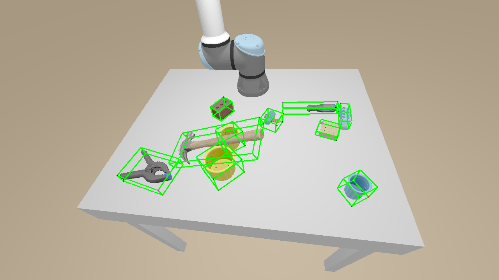
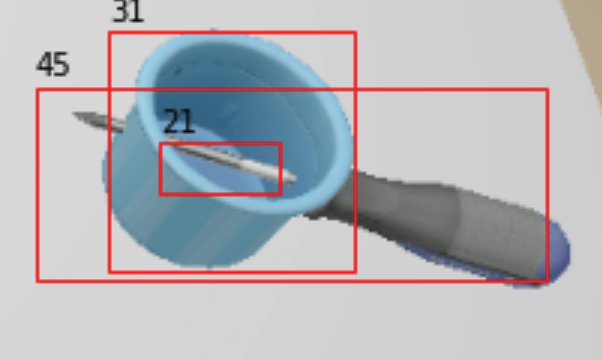

# How to Survive a Graduate Course as an Undergrad

At UCSD, graduate courses in computer science can be split generally into two categories. Courses that teach advanced topics for graduate students that extend the advanced courses designed for undergraduates, or courses that are fast-tracked versions of undergrad courses. Then there are research-centric courses that usually target a very specific domain and are run by a professor and/or their lab at UCSD. Both types are difficult, but the research-centric ones can vary wildly in difficulty.

These research-centric ones include the CSE 291's at UCSD. 

I took CSE 291-I at UCSD in the 2021 winter quarter (UCSD is a 3 quarter system). It's definitely not a course you can easily just walk through, given the fact that the content covers research published as recently as a few months ago, with assignments relying on research as early as 2 years ago.

In this post, I'll talk about [what I learned from this course](#What-I-Learned-a), [why I recommend graduate courses](#Why-Take-Graduate-Courses?-a), and [how one could succeed](#How-to-Succeed-a) in such a demanding course. To cap it off, for my fellow UCSD students, I detail about [how to enroll in graduate courses](#Enrolling-in-Graduate-Courses-a) given the fact that graduate students all get priority and, sometimes it's not clear as to what courses might be a good fit.

<h2 id='What-I-Learned'>What I Learned</h2>

CSE 291-I is a course at the intersection of geometry and machine learning. I learned a ton from **differential geometry**, the mathematics of rotation and SO(3) and, relevant optimizations, to **classical and deep learning approaches** to tasks such as 3D object segmentation, detection, and pose estimation. The course also introduced me to a lot of terminology and concepts necessary for understanding and working in the 3D computer vision field and brought in tons of top researchers in the field to give talks about their work such as human pose estimation by [Angjoo Kanazawa](https://people.eecs.berkeley.edu/~kanazawa/) (Berkeley, Google Research) and 3D detection by [Charles Qi](https://web.stanford.edu/~rqi/) (Stanford, Waymo).

This course at its core is math and programming heavy, with the homework being effectively solving math problems and programming models to solve a particular task like segmentation or pose estimation. What made it really fun was that there was a live benchmarking site where we submit our model's predictions to be ranked against everyone else in the course. At the end, after the final project, I effectively got to build a full 3D object pose estimation pipeline that takes as input just RGB-D (RGB and depth) data and various other metadata to predict poses of objects. 

A pose estimation task where the model must predict 3D bounding boxes around objects in a scene. I did quite well here!

Obviously, just about every single PhD student from Hao Su's lab ranked top. Although I would be curious if they could predict object segmentations for some funny samples I found when fine-tuning a [Faster RCNN model](https://arxiv.org/abs/1506.01497):

I guess it's difficult to detect the correct objects when one of them is impaling the other 😆

If you're interested, a full syllabus + most of the course slides can be found on the course website: https://haosulab.github.io/ml-meets-geometry/WI21/index.html

<h2 id='Why-Take-Graduate-Courses?'>Why take Graduate Courses?</h2>

There are a myriad of reasons aside from a graduate course looks great on your resume / grad school application. 

For one, the content taught is often closer to what state of the art methods rely on. The presentation by Charles Qi included work that was published just last year in [CVPR 2020](http://cvpr2020.thecvf.com/)! I effectively learned what the state-of-the-art approaches to different tasks are at the moment and if I wanted to, could implement them to varying degrees of success. 

Apart from learning about the **literal frontier** of computer science, these graduate courses give you a much more in-depth exploration and study of various topics. Sometimes the content is only recently researched, meaning there is a ton of opportunity for discussion on completely **novel ideas!** 

Moreover, research-centric courses usually have a **smaller class size**, which often invites a lot of insightful discussion and more 1 on 1 interactions with the other students and the professors. Most of the other students and the professor will have more experience than you, so to learn from them is a great opportunity that you won't often get at an undergraduate course. 

<h2 id='How-to-Succeed'>How to Succeed</h2>

Taking a graduate course has its many benefits, but at the end of the day it's not worthwhile if you can't do well in the course and/or ingest the content at a reasonable pace. These courses can be demanding. So here's a few general tips

1. **Start early.** You are highly likely to be behind in terms of necessary content. Unless you are an absolute genius, you have some catch up to do. For example, for CSE 291-I, our first homework was a refresher homework, meant to test our knowledge on basic requirements from probability to deep learning. Starting early will give you the appropriate time to catch up on some parts of the material and do well on homework and exams. Planning to take a course ahead of time will also give you time to refresh yourself on relevant material

2. **Always ask for help!** Don't be afraid to ask a stupid question, for all we know, other students are thinking the same thing. Luckily for my course, the professor encourages students to ask as many questions as possible and this is often the same for other professors. Questions not only get you recognized but help initiate an open discussion that is often rewarding. You don't always get a free chance to openly talk with the professor and disucss ideas. Moreover, the professor's job is to help you succeed in the course, and if you don't communicate, you make it just that much more difficult for the professor, they are there to help!

3. **Develop a solid mathematical background.** This might be one of the biggest caveats of higher level computer science courses. There is going to be math, and it is going to be hard if you don't learn the appropriate mathematics. Mathematics powers a ton of the heavy machinery used in computer science and a single lecture can easily get you lost in unknown symbols if you don't have a decent grasp of the math. Depending on domain, the graduate course will require different types of mathematics that you should make sure you have a decent grasp on. Don't be afraid to re-read your old linear algebra notes or refresh your knowledge on vector calculus, you will need it (subject to course domain of course).

   For students at UCSD, I highly recommend taking MATH 109 (Mathematical Reasoning) or MATH 31AH-CH (honors math) before diving into any more upper division math courses like statistics, numerical optimization, etc. MATH 109 or MATH 31AH-CH will give you a good problem solving framework and learn how to prove in math, which will greatly help you understand a long sequence of equations in any lecture or paper.

And some tips for courses with a ton of programming around deep-learning. This assumes you have decent familarity with python and a deep-learning framework like PyTorch or Tensorflow or whichever language and framework pair for the task at hand.

1. **Build out a flexible data pipeline.** My biggest mistake was trying to fiddle around with a small sample of the data and get some algorithms and models to work instead of building a flexible data pipeline to then test on. As a result, a lot of my code was very specific to the small sample of data and I spent a lot of time just reengineering code and reading my testing code to then build the datasets and pipeline for the course's homework. 

   By building a proper pipeline, not only is it easy to understand and use your code, but it'll probably speed up your training and testing process. Big recommendation: use the [Data module from PyTorch](https://pytorch.org/docs/stable/data.html) or the [Data module from Tensorflow](https://www.tensorflow.org/guide/data) if you use TF. Moreover, if you keep the data pipeline flexible, e.g. letting you vary the number of samples included in the dataset, you can then start doing the exploration stage of models much more easily and a simple change of a dataset parameter will instantly change your exploration into "production-ready" code (production ready as in you can use it now to finish the homework completely).

2. **Start small and naive, then increase complexity**. A simple, naive model helps you find bugs early on e.g. forgetting to scale/normalize data, faulty training scripts etc. Once you know everything works, then you can incrementally start adding components to your model or implement more complex architectures.

3. **Develop visualization functions.** Visual feedback is one of the best ways to understand what's happening with a model, especially in computer vision. Without the feedback, it's difficult to tell if your model is working as intended, and you will probably want to have some simple scripts to visually interpret model inputs and outputs, its architecture, etc.

4. **Using Jupyter Notebook.** Software such as Jupyter Notebook is great for exploratory programming when you want to test our new code and debug it, as well as explore potential options for a new model, algorithm etc. The fact that Jupyter Notebook lets you run parts of your code separately enables a ton of flexibility in development. Moreover, oftentimes there might be some data-loading involved that could take a while and Jupyter Notebook will let you load that into the RAM and keep it available while you explore instead of having to load it up again every time to test a new bit of code.

Last thing, be ok to jump ship and drop the course. Not all courses selected will turn out great for you and that's fine! Come back next quarter, or even next year. I promise you you won't be behind, the fact you might consider a graduate course as a undergraduate means you are way ahead of other students already and are not falling behind in terms of coursework.

<h2 id='Enrolling-in-Graduate-Courses'>Enrolling in Graduate Courses</h2>

There are two parts to enrolling in a graduate course. 

1. Figure out if the graduate course is suited for you and you can handle it.

2. Try to enroll in the class (can be a bit tricky)

tldr; For enrolling in graduate courses, always ask the professor about the course and ask them to help you enroll. It helps if you know the professor, have taken relevant courses, and can demonstrate a strong interest. Do all of this as early as possible.

### Figuring out if the course is right for you and you can handle it.

A lot of these graduate courses might not have enforced prerequisites, which means it is completely up to you to determine if **you can handle the course load** (even if there are some prereqs, they may not be accurate). Often times it's difficult to determine because a lot of the course descriptions put up online are limited, and any information regarding prerequisites is also limited. 

To address this, you should definitely **email the professor** running the course, ask them if given your background (list what you think might be relevant), if this course would be a good fit. This is also a great chance to ask any questions and to get to know the professor (which will help later when enrolling). 

If you are working at a lab that does similar work (or helps run the course you want to enroll in), I then also recommend asking the PI (principal investigator) of the lab for help on finding the right course and about whether you should join that course.

### Enrolling

Don't panic if the webreg system doesn't let you enroll / waitlist because you don't have authorization, and don't panic if your request to enroll / waitlist is not reviewed for a while.

First, realize that most of these graduate courses require graduate standing, preventing you from enrolling directly, so you will need to file a pre-authorization request. Even then, for the CSE department at least (and I suspect other depts. as well), they will not grant your request or consider it until all graduate students have had a chance to enroll / waitlist. 

Now supposing all grad students are finished selecting their courses, if there is still space left in the course, likely the department will then approve your request to join the course.

Now what might be more likely, there is a waitlist or there are just no spaces. Unfortunately, you will probably not get your authorization approved or even reviewed until all graduate students on the waitlist are removed. So considering this potential outcome, you should always reach out to the course professor **weeks in advance** and ask about whether it's possible for you to join the course and if not, ask if you can **audit** the course and join the lectures etc. Remember, in the end, a primary goal of taking graduate courses is **to learn**! Auditing is one way of doing it, albeit your homework and exams will not be graded.

It helps to know the professor beforehand or any professor who can put a good word in for you. In my case, my professor for the grad course is also the PI of the lab I'm in, so that was not difficult to ask for enrollment authorization. Reaching out to the professor beforehand is a great way to demonstrate interest and most professors are more than happy to find potential new students for their courses and their labs. Otherwise, the advice above is some advice that I collected from talking to other students who enrolled in graduate courses.
 
 
 
 
Anyway, blog post no.4 done, 

🌊

