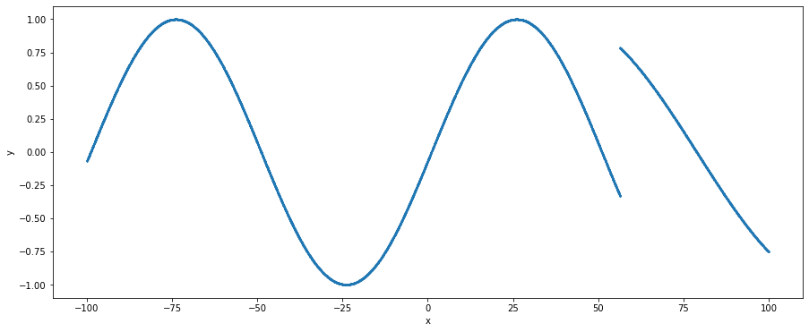

# High Precision Function Approximation With Decision Trees and Neural Networks

While I interned at [QuantCo](https://quantco.com/), I worked on a kind of crazy project with my (amazing) advisor [Ben Thompson](https://tbenthompson.com/), titled "The Deep Neural Net Function Approximation Project". Here's the problem (with sensitive information stripped):

One of the clients is currently migrating a system. Written in C, it comprises of a ton of data and a ton of different functions, many of which are high-dimensional and full of discontinuities. QuantCo has been tasked to help the client migrate all of that to a new system using python and onto the cloud to make it more efficient, faster, and secure. However, the client estimates it would take about 100 person-years to complete due to the complexity of the system, the immense amount of math, and the immense amount of functionality and code that need to be migrated. Luckily, QuantCo has already reduced that work to less than 1 person-year. But can we do this even faster? Could we somehow automate code migration and reduce the time even further?

Initially, this sounds like an impossible problem. Luckily, there are a few important things to note.

1. The client doesn't care what the migrated code is like; they simply expect that historical data plugged into the migrated functions produce the same values to within some max acceptable error.
2. We have the old system at our disposal. We can run it whenever we want.

**tldr;** points 1 and 2 allow us to almost automate code migration. Point 1 means we can treat it as solving a difficult regression problem. Our approach then lets us use both points to turn code into matrices with a decision tree neural net (DTNN) model that is horizontally and vertically scalable. There's also a bunch of [strange / interesting use cases](#Further-Applications) ranging from security to function compression to differentiating anyone's code (even if it doesn't really do any math).

Now here's a more formal statement:

Given some target function $f: \mathbb R^n \to \mathbb R^m$, approximate $f$ with another function $\hat{f}$ so that $\hat{f}(x) = \hat{y}$ is as close as possible to the ground truth $f(x)$. You are allowed to use $f$ to generate as many noiseless $(x, y)$ samples as you would like.

This function $f$ in our case is actually a giant file of code.

<h2 id="Uniqueness">What separates this from a typical regression problem</h2>

The above problem statement may seem somewhat trivial and seem like a typical regression problem, but there are a lot of hidden hazards that increase the difficulty immensely.

The target function we're approximating is extremely discontinuous and complicated. This arises from the fact the function will completely change behavior when certain inputs change. In our project, the target function is a super large, handwritten calculator that computes some value given some inputs. In this calculator, there are various if statements, matrix products, string manipulations, array slicing, every arithmetic operator, and even reading data from data files that contribute to the outputs.

This means the majority of the classical regression models and any function approximation methods will almost certainly fail at regions of discontinuity in the target function, but for our problem, we need to make sure **every single** data point is approximated to within 1 of its true value. Moreover, different smooth regions in the target function all behave potentially completely different (one might be $e^x$, another might be $x^2- 3|x|$ all of a sudden)

Additionally, the target function produces values in the range of 1e5 to 1e7, which means our function approximator needs to **achieve a precision of around 1e-5 to 1e-7** to pass. 

Lastly, the target function has a high input and output dimensionality, both of which are in the order of 100s. This adds difficulty for any kind of model and slows down training and decreases accuracy. Additionally, we can't apply any kind of feature selection and / or dimensionality reduction without the potential loss of information necessary for producing accurate output values.

In a nutshell, we solve a difficult regression problem, but there are a number of quirks in our case, namely

1. We have an oracle $f$​ (also our target function) that can generate noiseless groundtruth $(x, y)$​​ pairs on the fly.
2. $f$​ is extremely discontinuous and changes a ton around discontinuities
3. We need to achieve a high degree of precision on the orders of 1e-5 to 1e-7
4. $f$ also has 100s of dimensions in its input and output spaces

Because of these quirks, many approaches have been investigated, and I'll go in depth in the following 4

1. Neural Networks
2. 2nd order optimization of Neural Nets for regression
3. Residual-based splitting
4. Decision Trees + Neural Nets (DTNN)

These proved to be the most influential and powerful methods out of all the other tricks and techniques we experimented with.

<h2 id="Neural-Networks">Neural Networks</h2>

Why deep neural nets for an approximation problem?

If we first consider the naive approach of storing a bunch of pre-computed pairs $(x, f(x))$​​ for all $x$ values in the historical data, we would have a perfect approximator. However, there not only is a ton of historical data (likely on the scale of petabytes), using this as a function to then retrieve a value for a given $x$​​ would take an unreasonably long time. Supposing you used some kind of nearest neighbor weighting model and stored a fraction of the historical data values and reduced the search time to find the $k$ nearest data points necessary for interpolation to reasonable milliseconds, then the accuracy worsens significantly.

Now suppose we first ignore the discontinuities in our target function, we otherwise have very little information about what the target function is like without having to dive deep into the function's code itself or doing significant data analysis on an extremely complex function. So most attempts to tackle this like a data science problem end up failing here. We need something that is flexible and can capture almost arbitrary patterns in the data.

Luckily, since the client only cares that all historical data when passed through the approximated function are correct, we don't need to worry about extrapolation, so potentially interpolation algorithms can come into play. We could generate many interpolation points and use interpolation algorithms such as [polynomial interpolation](https://en.wikipedia.org/wiki/Polynomial_interpolation), which in fact get really good approximations. Unfortunately, interpolation algorithms cannot scale when the dimensions increase and they begin to have impossible memory requirements after about as little as 5 dimensions for our particular target function. Trading off accuracy for lower memory requirements is also unfortunately very poor.

Deep neural nets on the other hand are flexible function approximators and scale much better with dimensions in terms of both memory and compute, and arguably compress information much better than the interpolation algorithms at the cost of spending time training.

The typical way to use neural nets in a regression problem is to train the neural net over a lot of training data, constantly evaluate it on a held-out validation dataset and select the model that achieves the lowest loss on the validation dataset. In particular, the loss function is the MSE loss function and the optimizer that worked best was Adam. I won't explain much in detail here, but tanh activation turns out to be the best and outperforms any non-smooth activation like ReLU significantly.

However, standard neural networks on their own are nowhere near sufficient to achieve any level of desirable accuracy in our project, and the next section discusses the first massive improvement in performance via 2nd order optimization.

<h2 id="2nd-Order-Optimization">2nd Order Optimization</h2>

Almost ubiquitously, deep learning practitioners rely on first-order optimization algorithms such as Gradient Descent, Adam, RMSProp to name a few. These methods prove incredibly useful in many tasks because they are fast, computationally efficient and feasible, often bug-free, and many other reasons listed out in this [stackoverflow answer](https://stats.stackexchange.com/a/394108). Another important aspect of first-order methods is that they achieve low generalization error compared to second-order methods, making algorithms like SGD and Adam incredibly popular in CV and NLP tasks where generalization error is paramount.

However, some of these aspects are not a problem in our project. Generalization error is less of an issue since we can generate infinite, noiseless data, with the same distribution as test data, and in fact we can control the generalization error by tuning how much data is fed to the model at training time. In a future section when I discuss about the DTNN model, we also don't need as much data as you think to be generated to ensure low generalization error. For similar reasons, in the DTNN model the neural networks trained are generally quite small, so we don't have an issue of scale faced by 2nd order optimization of large neural networks.

These features of our project suddenly make 2nd order optimization algorithms much more feasible. Since we want to achieve an extremely high level of precision, 2nd order optimization actually becomes necessary.

[L-BFGS](https://en.wikipedia.org/wiki/Broyden%E2%80%93Fletcher%E2%80%93Goldfarb%E2%80%93Shanno_algorithm) proves to be a very capable and feasible 2nd order algorithm that ended up being used throughout this entire project. The following graph shows as a function of time (s), how L-BFGS compares to Adam, a 1st order method when trying to fit the function $\cos(20x)$​ over $x \in [-1, 1]$ with a small neural network (~40 parameters). The data generated and fed into the neural network mimics that of the actual project. Very quickly L-BFGS converges to a low loss and outperforms Adam considerably.


With 2nd order optimization, a single deep neural net was able to achieve about 30% accuracy on test data in the project, meaning it predicted 30% of data points to within 1 of its true value. But this is about as far as it will go, and can't scale farther in any direction (model complexity, time, data etc.) without entering scaling problems or hitting a minimum. The major issue is that discontinuities reduce the performance of the neural net as it attempts to fit a smooth model over it, in addition to having major approximation errors around the discontinuities. I tackle this issue next.

<h2 id="Residual-Based Splitting">Residual-Based Splitting</h2>

We can treat any arbitrary function like our target function as being some piecewise smooth function if you split the input space into the right regions. So one solution is to identify the smooth regions of the input space and train a different function approximator that can achieve high precision and doesn't need to worry about fitting to discontinuities. Thus, the fundamental reason for using a Decision Tree for this problem is to **handle discontinuities**.

Before diving into how a DT and NN work together, let's first look at the splitting algorithm that drives it.

To understand how the splitting works to find discontinuities, I'll demonstrate it on a simple one-dimensional discontinuous sine dataset which is shown below.



There's a clear jump discontinuity at around `x = 56` which would cause regression to be difficult! But let's do a bit of overkill and try fitting a tanh activated neural network with L-BFGS to this data, we generate the following predictions (orange) compared to the ground truth (blue)


Notably, we observe that on the smooth parts of the dataset, the neural network more or less fits it well. However, as we approach the discontinuity the predictions begin to vary a lot and we can see that the neural net attempts to make a smooth connection between the start and end of a discontinuity. Visually it's clear where the discontinuity is, and we can identify this algorithmically by using residuals, which is equal to `prediction - ground_truth`, and when we plot the residuals we get


The residuals are a strong signal of where the model has fitted well and where it hasn't. We can see that the residual magnitude is near 0 on smooth parts, and increases significantly near the discontinuity. We can then clean up this signal further by taking the top 99th percentile of residuals by magnitude, leaving us with the following data points. The red dashed line represents the location of the true discontinuity.


We observe now that amongst the largest residuals, residuals increase in magnitude in the negative direction as we approach the discontinuity before suddenly flipping in sign and decreasing in magnitude as we move away from the discontinuity. This is something that will often happen when fitting smooth models like a neural network with smooth activation to the discontinuity as the model attempts to find a smooth transition around the discontinuity. However, as a result, the residuals will have a sign flip and / or a large increase in magnitude around the discontinuity.

A direct algorithmic way to then find this discontinuity is to use the splitting algorithm regression DTs use, which is finding a split on one of the input dimensions that minimizes the mean squared error of the 99th percentile residuals. Visibly, we can see that such a split would minimize the MSE by splitting near the discontinuity. This serves as a rather crude (but surprisingly effective) approach to identifying residuals with minimal overhead.

There can be a lot of further research on discontinuity finding to improve this, from refining a split decided by a DT by generating more data near the split or finding other algorithms that discover  and can ignore the noise potentially introduced by poor-fitting in other input space regions, in addition to being more effective in higher dimensions where discontinuities in other dimensions or spanning multiple dimensions can make this much more complex.

<h2 id="DTNNs">DTNNs</h2>

Now that we have in our toolbox a neural network-based function approximator and a method to identify discontinuities and separate out the smooth regions in the input space, we can combine these into a single decision tree neural network model. This combination then allows us to also make effective use of a key property of this problem, which is that we can **generate data on the fly** using the target function.

At a high level, a DTNN is a decision tree with neural nets at each leaf that perform the regression for any data that falls to that leaf, and the splitting algorithm is the residual-based splitting method. Thanks to the splitting of the input space, we also don't need as much data or as big of a neural network model at each leaf to sufficiently capture the behavior there with high accuracy.

### Growing the DTNN

The growing algorithm is quite similar to a typical decision tree growing algorithm but with a few changes. The DTNN maintains the same procedure of taking each leaf node and determining first whether to continue splitting, then deciding on the best split to make before making the split.

One key difference is that every leaf has an associated neural network that does the prediction for all data that falls into that leaf's data range (the subset of the input space it represents). Note that each leaf is associated with a disjoint subset of the input space of the target function, and the union of all these disjoint subsets forms the entire input space (up to the boundaries set for interpolation).

For leaf node splitting, the residual-based splitting method introduced earlier is used and the residuals are computed using the trained neural net associated with the leaf. Importantly, since we can generate infinite data, this model can become infinitely precise to the point it memorizes every input output pair via splitting the input space into extremely data ranges. Thus, we only split leaf nodes where the neural network trained there is not accurate enough. Ideally, this neural network reduces the need to memorize every value and learns a good approximation with fewer parameters.

For each new leaf produced after splitting an old leaf, we create a new associated neural net. These new neural nets are copies of the neural net associated with the old leaf, helping speed up training with a warm start.

Lastly, we regenerate data in each new leaf, using randomly selected inputs data points that fall within the new leaf's data range, and train the neural net on that new data.

Visually, growing a DTNN looks like this:


A green circle represents a leaf node that has a trained neural network that is accurate enough, a blue node is an internal node or a to be trained leaf node. Each round, we increase the depth of the tree by one via residual-based splitting and only generate two children per leaf node, and then fine tune the neural nets at all leaf nodes that need fine tuning.

### DTNN Pseudocode

For those who prefer pseudocode, the growing algorithm is as follows

```pseudocode
def DTNNGrow(rounds, train_net, data_generator, pass_criteria, splitting_func, input_subspace):
    root_node := initialize a DTNN with a empty root node associated with input_subspace
    leafs_to_train = { root_node }
    passing_leafs = {}
    for round = 1 to round = rounds:
        if leafs_to_train is empty:
            return root_node
        for leaf in leafs_to_train:
            # generate data within the subset of the input space of data that falls in the leaf
            train_data, test_data := data_generator(leaf.data_range)
            if leaf has a parent node:
                neural_net := copy of neural net in parent node
            else:
                neural_net := initialize a new neural net
            # train a NN until its good enough or until some max iterations
            train_net(neural_net, train_data, test_data)
            remove leaf from leafs_to_train
            if pass_criteria(neural_net, test_data):
                add leaf to the set passing_leafs
            else:
                # split the subspace of the current leaf based on the trained NN and train_data
                data_ranges := splitting_func(neural_net, train_data, leaf.data_range)
                for data_range in data_ranges:
                    new_leaf := initialize a new leaf node associated with data_range
                    add new_leaf to the set leafs_to_train
		return root_node
```

We grow the DTNN in rounds, with each round increasing the depth of the DTNN by 1. To train, you provide the number of training rounds, a neural net training function, the data generator, a pass criteria function, and a splitting function.

The neural net training function `train_net` should take a neural net, training data, and test data generated from the `data_generator` that is within a leaf's data range, and train that neural net. Usually, this stops training when the neural net is accurate enough, or when it is training for too long. 

The `data_generator` will usually be a wrapper function around the target function we want to approximate where it takes a data range and produces training and test data that is within that data range. Our experiments used uniform sampling across each input dimension of the data range, but I actually recommend using something akin to [farthest point sampling](https://jskhu.github.io/fps/3d/object/detection/2020/09/20/farthest-point-sampling.html) (common sampling technique in 3D computer vision like sampling point clouds).

The `pass_criteria` function will evaluate a neural net over the given test data and would return `true` if the neural net is good enough and `false` otherwise. This function is important since the data is noiseless and infinitely generatable, so theoretically you can always keep improving but we need to stop eventually.

The `splitting_func` is a function that when given the neural network, the training data, and the data range the training data is generated from, returns the new data ranges for all new leaves. An example would be the residual-based splitting method.

The `input_subspace` is simply the data range of inputs that we want to approximate the target function over, and the root node of the DTNN is associated with this input subspace. For our project, this would be the boundaries of every feature dimension in the historical data.

### DTNN Discussion

#### Results

With the DTNN and residual-based splitting and 2nd order optimization, we raised that 30% to about 86% of test data points approximated to within 1, despite data points being on the order of 1e5 to 1e7. In particular, the single NN and DTNN were both trained on a single CPU for 64 hours and achieved 30% and 86% accuracy respectively. This outperforms just about any regression model we tried, from GBDTs (~2% accuracy), to first-order optimized neural nets (~2% accuracy), to interpolation algorithms (infeasible).

The major reason the DTNN achieves such a massive improvement is in addition to 2nd order optimization, it also can **effectively leverage the data generating aspect of the problem** in an efficient distributed manner via a decision tree structure. Intuitively, each split at a leaf reduces the data range for the new leaves, meaning less data is necessary to be kept around in memory to achieve low generalization error, and effectively optimize a neural network as well. Models that can't leverage the data generation will have to rely on generating a huge amount of data that can barely fit in memory or augmenting data every round. Even with some kind of data generation mimicking that of the DTNN where data is effectively generated for leaves that need more training / high error regions in the input space, models like single neural nets will need to not only be massive, but also somehow solve the issue of [catastrophic forgetting](https://en.wikipedia.org/wiki/Catastrophic_interference).

The DTNN also has a number of nice properties. One is that it is highly scalable compared to neural networks, another is that it has unbounded performance potential with no generalization problems (usually). There are a bunch more but these are listed in the [further applications section](#Further-Applications). There's also a [further research topic section](#Further-Research-Topics) that lists out a number of questions my advisor and I asked that we didn't have time to explore but are probably worth exploring and can improve the results.

#### Scaling

You can easily parallelize the DT growing process by training each leaf on a separate core, subject to balancing issues if there are only 2 leaves training and one takes a lot longer than the other. Moreover, this project is more often CPU bottlenecked as the target function tends to be the main limiting factor due to data generation speeds, so GPUs aren't really necessary (nor are 2nd order optimization methods that well optimized on the GPU), so in terms of scaling, you can simply increase the number of CPUs (generally quite easy) and achieve pretty high efficiency in training speed vs number of CPUs used.

You can even horizontally scale this process across multiple servers probably, although I'm not exactly sure how much of an overhead that might have. I suspect it should be fairly low since the only unique data each different server has is the data range and the neural network, everything else is the same from the target function / data generator, to the neural network architecture and splitting function.

#### Unbounded Potential

In theory, with a target function at hand to generate noiseless training data, the DTNN can get **100% of training and test data points approximated to not just within 1, but even 0.1, 0.01, etc.** when given sufficient time, a guarantee that cannot be said of any other model that I'm aware of (except for an extremely, out of memory, DT kind of model which at that point is really just memorizing the training data).

This is thanks to the fact that the test data will always be "in distribution" since it's generated from the same function as the training dataset (and generally mimics the historical data the client has). As long the neural network at each leaf is given sufficient data points, it will have minimal to no generalization error.

Moreover, every split on the data range makes training neural nets easier and easier as you effectively cut the hard part of the regression problem out and leave just the smoother regions of data. This is an easy direct way of adding parameters to the model to boost performance without making a neural network bigger and scales linearly with each leaf added.

<h2 id="Further-Applications">Further Applications</h2>

In addition to just solving the formal problem of approximating a target function with high accuracy and precision, there are a number of other applications of this since we effectively turn lines of code that form the target function into matrices! Here is a non-exhaustive list of some of these applications

- **Function compression:** Reduce the amount of space required for purpose of approximation. Moreover, the calculator that was being approximated in my project actually pulls data from various tables and the neural nets are capable of removing the need for that data and bake that information into their model parameters
- **Faster computations:** speed up an existing function with a faster model that approximates it. Easily trading off accuracy for speed.
- **Differentiation:** Differentiate a handwritten function for analysis purposes. Derivative information is often useful for many problems such as optimization. My advisor had the idea of potentially trying to determine which other calculators in our client's old system were most similar to the one we approximated and first-order information would be helpful in determining this.
- **Portability:** A decision tree and their neural networks can be easily packaged as some matrices in a single data file which can easily be run anywhere without needing access to sensitive files and data.
- **Security:** A file containing just matrices makes people very comfortable compared to a calculator with 1000s of lines of code and poses a minimal security risk should these matrices get stolen as business logic cannot be read from them.

<h2 id="Further-Research-Topics">Further Research Topics</h2>

We faced a number of interesting problems in an effort to approximate our target function, all of which may benefit from additional research to improve training time, accuracy etc.

**Handling discrete/continuous:** Discontinuity finding may differ when the input dimension is discrete or continuous. Perhaps some kind of bisection search method may find the true discontinuity with high precision and accuracy or using some form of refinement procedure to fine tune a split on a continuous axis.

**Non-linear/non-axial discontinuities:** In higher dimensions, discontinuities may not be axial and may be non-linear. While these discontinuities can sometimes be approximated by several axial/linear splits on the input data space range, there are likely more efficient methods that allow for non-linear splits that can cover a wider range of potential discontinuities. One method might be to replace the splitting function with a neural net trained to perform "split classification". Not only does this enable non-linear splits, but it would also make the entire DTNN model end to end learnable and differentiable which could have potentially interesting results.

**Data generating given non-linear/non-axial splits:** Supposing the above problem was dealt with and we now have a splitting function that effectively classifies a data point as being one of `k` classes. How do we generate data for each of these classes?

**Adaptive data generation:** When not enough data is provided for training, a model will get a high generalization error which is not desirable. However, when too much data is provided, the marginal improvement in generalization error is likely not worth the amount of extra training time required. Thus, there is probably some kind of optimal data generation amount at each leaf of the DTNN.

**Adaptive early stopping:** Notably, just increasing the total number of training iterations per leaf does not necessarily correlate with a better model when training for the same total amount of time as a model can begin to struggle due to  discontinuities. Empirically, too many iterations makes the model spend too much time trying to approximate discontinuities when it is better off performing a split first, then training for much longer. Can we somehow optimally determine when to perform a split to deal with discontinuities?

<h2 id="Closing-Notes">Closing Notes</h2>

I had a great time at QuantCo and working with my advisor on this problem. If you are ever interested in the craziest engineering, machine learning, data science, etc. problems, pay them a visit. Or if you like good company and food, they're also a great place.


Anyway, sixth blog post done,


🌊
